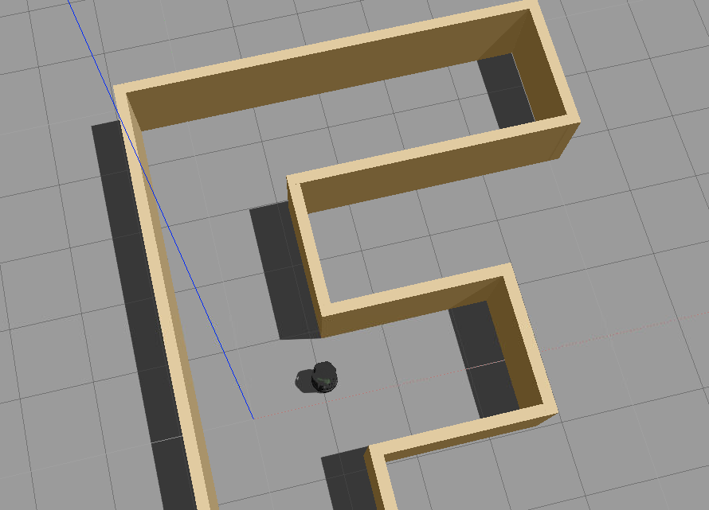

# RoboND - Home Service Robot Project

### Information
This is the final project of the second term of the Robotics Software Engineer Nanodegree from Udacity.
The goal is to set up a robot to map a simulated environment, navigate through the map and reach specific locations.

Main tasks include:
* Design the environment using Gazebo Building Editor
* Use a C++ node to make the Turtlebot robot move alongside the wall
* Autonomously map the environment using the gmapping node
* Perform navigation with the amcl node
* Reach multiple goals by interfacing with the move_base navigation stack.
* Mark virtual objects in RViz using visualization_msgs
* Integrate all the nodes to simulate object picking activity

The approach used to complete the last task was to create an additional topic to integrate the pick_object_node and the add_markers_node. A string message was sent to the add_markers_node that used a listener class with a callback function to subscribe to the relevant topic.

### Results

The Simulated TurtleBot sucessfully navigates to the picking and dropping location.

### Future activities
* Explore limitation in more complex environments
* Test in real robots
* Experiment newer mapping algorithms such as cartographer.
